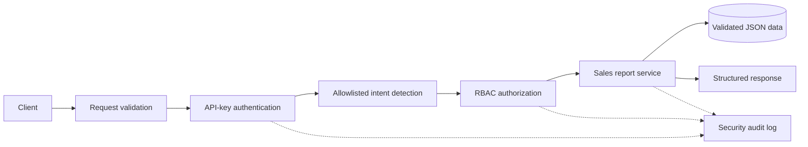

# Secure AI Platform API

A security-first FastAPI backend that accepts authenticated business questions,
maps them to an allowlisted workflow, enforces role-based authorization, and
generates a weekly sales report from validated mock enterprise data.

The project intentionally uses a deterministic intent service instead of a
paid LLM. This keeps the demo free, reproducible, and prevents model output
from directly controlling privileged actions. The `IntentService` interface
can later be implemented by a local model or hosted provider without changing
the authentication, authorization, or business layers.

## Architecture



Security and business decisions stay in normal Python code. The intent layer
only classifies a request; it never authenticates users, grants permissions, or
executes arbitrary commands.

## Features

- `POST /ask` enterprise question endpoint
- `X-API-Key` authentication with constant-time secret comparison
- Role-based access control for viewer, analyst, and admin users
- Strict Pydantic request and business-data validation
- Free rule-based intent workflow with an explicit action allowlist
- Weekly sales-report business action using precise decimal arithmetic
- Structured JSON audit events without API keys or raw questions
- Server-generated request IDs in responses and logs
- Centralized error responses that hide validation and internal details
- Automated tests for valid, malformed, unauthenticated, and forbidden requests

## Project structure

```text
app/
|-- api/ask.py                 # POST /ask orchestration
|-- core/
|   |-- audit.py               # Structured security events
|   |-- authorization.py       # RBAC permission matrix
|   |-- config.py              # Validated environment configuration
|   |-- exceptions.py          # Safe centralized errors
|   `-- security.py            # API-key authentication
|-- data/sales.json            # Mock enterprise data
|-- models/schemas.py          # Request and response contracts
|-- services/
|   |-- intent_service.py      # Free deterministic workflow
|   `-- report_service.py      # Business action
`-- main.py                    # Application setup and request middleware

tests/                         # Unit and end-to-end security tests
```

## Local setup on Windows

Python 3.11 or newer is recommended.

```powershell
py -m venv .venv
.\.venv\Scripts\python.exe -m pip install -r requirements.txt
Copy-Item .env.example .env
```

Generate three different keys. Run this command three times and place each
result in `.env`:

```powershell
.\.venv\Scripts\python.exe -c "import secrets; print(secrets.token_urlsafe(32))"
```

Your `.env` should contain unique values:

```dotenv
APP_ENV=development
LOG_LEVEL=INFO
VIEWER_API_KEY=<unique-viewer-key>
ANALYST_API_KEY=<unique-analyst-key>
ADMIN_API_KEY=<unique-admin-key>
```

The application rejects missing, short, or duplicate role keys during startup.
The real `.env` file is ignored by Git.

Start the server:

```powershell
.\.venv\Scripts\python.exe -m uvicorn app.main:app --reload
```

Useful URLs:

- Health check: `http://127.0.0.1:8000/health`
- Interactive API documentation: `http://127.0.0.1:8000/docs`
- OpenAPI document: `http://127.0.0.1:8000/openapi.json`

## API usage

Replace `<analyst-key>` with the configured analyst key.

### Valid business action

```powershell
curl.exe -X POST "http://127.0.0.1:8000/ask" `
  -H "Content-Type: application/json" `
  -H "X-API-Key: <analyst-key>" `
  -d '{"question":"Generate this week''s sales report."}'
```

Example result:

```json
{
  "request_id": "1ef00b65-4290-4d16-a557-cea5794311ec",
  "answer": "Weekly sales report generated for 2026-06-29 through 2026-07-05. Total sales were 5000.00 across 6 transactions.",
  "action": {
    "name": "generate_sales_report",
    "data": {
      "period_start": "2026-06-29",
      "period_end": "2026-07-05",
      "transaction_count": 6,
      "total_sales": "5000.00",
      "average_sale": "833.33",
      "sales_by_region": {
        "East": "799.50",
        "North": "1600.50",
        "South": "1100.00",
        "West": "1500.00"
      }
    }
  }
}
```

### RBAC security scenario

Use the viewer key for the same report-generation request:

```powershell
curl.exe -X POST "http://127.0.0.1:8000/ask" `
  -H "Content-Type: application/json" `
  -H "X-API-Key: <viewer-key>" `
  -d '{"question":"Generate this week''s sales report."}'
```

The authenticated viewer receives `403 Forbidden`:

```json
{
  "error": {
    "code": "forbidden",
    "message": "Insufficient permissions",
    "request_id": "a-server-generated-uuid"
  }
}
```

Missing and invalid keys receive `401`, malformed payloads receive `422`, and
unsupported requests receive `400`.

## Featured security improvement: RBAC

### What was implemented

The application maps each authenticated API key to one role and checks an
explicit permission before executing a business action:

| Role | View report | Generate report | Administer system |
|---|---:|---:|---:|
| Viewer | Yes | No | No |
| Analyst | Yes | Yes | No |
| Admin | Yes | Yes | Yes |

Permissions are immutable and default to deny when not explicitly granted.

### Why it improves security

Authentication only establishes who the caller is. RBAC separately controls
what that caller may do, keeping privileges aligned with business duties.

### Risk prevented

RBAC prevents authenticated but low-privilege users from performing sensitive
business actions. It reduces excessive privilege, unauthorized report
generation, and privilege-abuse risk.

## Audit logging

Security events are emitted as JSON and include a timestamp, request ID,
event, outcome, identity, role, and allowlisted action or reason where relevant.
Logs deliberately exclude API keys and raw user questions.

Example:

```json
{"action":"generate_sales_report","event":"business_action_succeeded","outcome":"success","request_id":"...","role":"analyst","timestamp":"...","user_id":"analyst-user"}
```

## Tests

```powershell
.\.venv\Scripts\python.exe -m pytest -q tests -p no:cacheprovider
```

The suite covers schemas, authentication, RBAC, intent classification,
business-data validation, API integration, audit safety, and error disclosure.

## Debugging insight

An unexpected-exception test initially returned a safe `500` body but no
`X-Request-ID`. The request-context middleware reset its context variable before
FastAPI's outer exception handler built the response. The fallback handler was
moved inside the request-context boundary so the audit event, error body, and
response header now share the same ID.

## Engineering tradeoff

The deterministic intent service is less flexible than a general LLM, but it is
free, fast, reproducible, and easier to secure. It cannot invent tools or
actions: requests that do not match the allowlist are rejected. A model can be
added later for language understanding while application code continues to own
authentication, authorization, and execution.

## Production follow-ups

For a real multi-instance deployment:

- Store hashed or managed API credentials in a secret manager and rotate them.
- Terminate TLS at a trusted gateway and enforce HTTPS.
- Forward audit events to a protected, append-only SIEM destination.
- Add distributed rate limiting through an API gateway or Redis.
- Replace mock JSON with an access-controlled database or enterprise service.
- Run dependency, static-analysis, secret, and container scans in CI.
